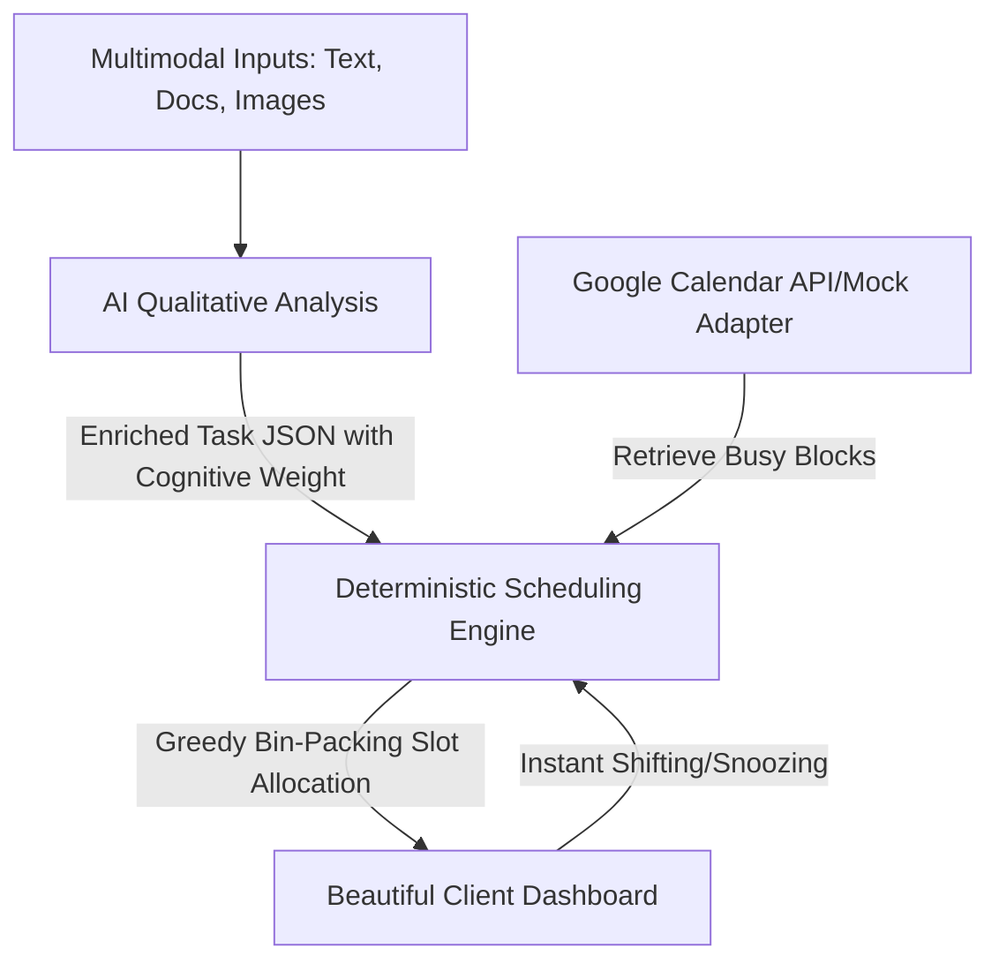

# 🔄 Synkrohan | Intelligent Collaborative Hybrid Scheduler

<div align="center">
  
  <p><strong>A state-of-the-art collaborative hybrid time-blocking scheduler built for the CodeKada Hackathon.</strong></p>
  
  <p>🌐 <strong>Live Application: <a href="https://synkrohan.vercel.app/" target="_blank">synkrohan.vercel.app</a></strong></p>

  [](https://nextjs.org/)
  [](https://react.dev/)
  [](https://www.mongodb.com/)
  [](https://synkrohan.vercel.app/)
</div>

---

## 🌟 Overview

**Synkrohan** is an intelligent, collaborative, hybrid time-blocking platform designed to revolutionize how individuals and collaborative teams organize their schedules. By leveraging multimodal AI models (like Gemini and Gemma) alongside high-performance deterministic scheduling algorithms, Synkrohan manages task intake and slot allocation. 

Unlike traditional calendar tools or raw AI scheduling (which is slow, expensive, and prone to hallucinations), Synkrohan employs a **Hybrid Scheduling Pipeline**:



1. **The Brain (AI Qualitative Analysis)**: Multimodal AI model processes raw inputs—such as a syllabus screenshot, text transcripts, documents, or personal preferences—and outputs a mathematically agnostic JSON schema containing task properties (e.g., splittability, cognitive load, buffer times, preferred window of day).
2. **The Hands (Deterministic Bin-Packing)**: A hard-coded, rapid JavaScript greedy algorithm takes the AI-generated schema, checks real-time availability from third-party calendars, and maps tasks into optimal open slots. When you update or snooze a task, the engine recalculates the entire calendar in **milliseconds** without calling external AI APIs.

---

## 🚀 Key Features

*   🧠 **Multimodal Ingestion**: Feed syllabus documents, text descriptions, notes, or layout screenshots to have them analyzed and structured automatically.
*   ⚡ **Lightning-Fast Recalculations**: Re-arrange your schedule dynamically in milliseconds without high latency or LLM processing costs.
*   🤝 **Scheduling Environments ("Docs-style" approach)**: Group calendars and tasks into isolated workspaces (e.g., *"Hackathon Workspace"*, *"Capstone Space"*, *"Personal Errand Space"*).
*   📊 **Productivity Telemetry**: Live dashboards and workspace telemetry monitoring deep-work hours, project completion rates, and workload density.
*   🔄 **Extensible Calendar Syncing**: Built using a service-adapter architecture allowing integration with multiple external calendars—powered by Google Calendar and mock providers.
*   💬 **Real-time Live Workspace Sync**: Synchronizes collaborative tasks and workspace state across multiple connected browsers instantly (using Pusher/WebSockets).

---

## 🛠️ Tech Stack

*   **Frontend & Backend Core**: [Next.js 15 (React 18)](https://nextjs.org/)
*   **Database**: [MongoDB / Mongoose](https://www.mongodb.com/)
*   **Authentication**: [NextAuth.js](https://next-auth.js.org/) (Google OAuth 2.0 & Credentials-based fallback)
*   **AI Engines**: [Google Gemini 1.5](https://deepmind.google/technologies/gemini/) / Google Gemma (via Ollama Cloud)
*   **Real-time Synchronization**: [Pusher](https://pusher.com/)
*   **Testing**: [Cypress E2E Testing](https://www.cypress.io/)

---

## 📋 Prerequisites

To run Synkrohan locally, ensure you have the following installed:
*   [Node.js](https://nodejs.org/) (version `v18.x` or `v20.x` recommended)
*   [npm](https://www.npmjs.com/) (installed alongside Node)
*   A running [MongoDB](https://www.mongodb.com/) instance (either local or a MongoDB Atlas Cloud connection string)

---

## ⚙️ Setup and Installation

### 1. Clone the Repository
```bash
git clone https://github.com/AndreiPalonpon/Codekada_TernaryKoders.git
cd Codekada_TernaryKoders
```

### 2. Install Dependencies
```bash
npm install
```

### 3. Setup Environment Variables
Create a `.env.local` file in the root directory of your project. Copy and populate the following keys:

```ini
# MongoDB Connection String
MONGODB_URI="your_mongodb_connection_string"

# AI Core Configuration
# Options: GEMINI | DEEPSEEK | GEMMA
ACTIVE_AI_PROVIDER="GEMINI"
GEMINI_API_KEY="your_gemini_api_key_here"

# Ollama / Gemma fallbacks (if applicable)
OLLAMA_API_KEY="your_ollama_api_key"
OLLAMA_BASE_URL="https://ollama.com/api"
GEMMA_MODEL="gemma4:31b"

# NextAuth Configuration
# For local development, set to http://localhost:3000
NEXTAUTH_URL="http://localhost:3000"
# Generate a secret key using: openssl rand -base64 32
NEXTAUTH_SECRET="your_nextauth_jwt_secret_hash"

# Google Calendar Integration (OAuth 2.0 Credentials)
GOOGLE_CLIENT_ID="your_google_client_id.apps.googleusercontent.com"
GOOGLE_CLIENT_SECRET="your_google_client_secret_string"

# Collaborative Real-time State (Pusher)
ENABLE_COLLAB=false
```

---

## 🖥️ Running the Application

### Development Server
Start the development server with hot-reloading:
```bash
npm run dev
```
Open [http://localhost:3000](http://localhost:3000) in your browser to view the application.

### Production Build
Build and start the highly optimized production bundle:
```bash
npm run build
npm run start
```

### End-to-End Cypress Tests
Run the integration and scheduler test suites:
```bash
# To run tests headless
npm run cypress:run

# To open the Cypress interactive browser console
npm run cypress:open
```

---

## 🔐 Authentication & Login Instructions

Synkrohan supports **two authentication pathways** to provide maximum convenience for testers, developers, and final users:

### A. Credentials-Based Login (Fast Local Testing)
1. Navigate to `/login` (the home page redirects you here if not authenticated).
2. Click **"Sign up"** at the bottom of the card.
3. Fill in your name, email, and password, then click **"Create Account"**.
4. The system will automatically hash your credentials securely, provision your account in the MongoDB database, and log you into the workspace dashboard.

### B. Google Single Sign-In (OAuth Pathway)
1. Click **"Sign in with Google"** on the login page.
2. Complete the Google authorization consent form.
3. This will securely connect your email, name, and profile photo, and link your calendar permissions automatically.

> [!IMPORTANT]
> The Google Calendar integration is fully functional only when logging in via Google OAuth. Read the next section to configure this capability.

---

## 📅 Google Calendar API Integration Setup

To read and write scheduling events to a real Google Calendar, you must configure a Google Cloud Developer Project.

### 1. Create a Google Cloud Project
*   Go to the [Google Cloud Console](https://console.cloud.google.com/).
*   Create a new project named `Synkrohan` (or any preferred name).

### 2. Enable Google Calendar API
*   In the sidebar, navigate to **APIs & Services > Library**.
*   Search for **"Google Calendar API"**.
*   Click **Enable**.

### 3. Configure OAuth Consent Screen
*   Navigate to **APIs & Services > OAuth consent screen**.
*   Choose **External** user type.
*   Provide your App Name, User Support Email, and Developer Contact Email.
*   **Scopes Configuration**: Add the following scopes:
    *   `.../auth/calendar.events` (to write and edit calendar schedule slots)
    *   `.../auth/calendar.freebusy` (to read busy and free time blocks)
*   **Test Users**: Add the email addresses of the Google accounts you intend to use for local testing (critical while in testing mode).

### 4. Create OAuth Credentials
*   Navigate to **APIs & Services > Credentials**.
*   Click **Create Credentials** and choose **OAuth client ID**.
*   Select **Web application** as the Application Type.
*   Add **Authorized JavaScript origins**:
    *   `http://localhost:3000`
    *   `https://synkrohan.vercel.app`
*   Add **Authorized redirect URIs**:
    *   `http://localhost:3000/api/auth/callback/google`
    *   `https://synkrohan.vercel.app/api/auth/callback/google`
*   Click **Create** and copy your **Client ID** and **Client Secret**.
*   Paste them into your `.env.local` file as `GOOGLE_CLIENT_ID` and `GOOGLE_CLIENT_SECRET`.

---

## 👥 Meet the Developers (Ternary Koders)

Synkrohan is proudly developed and maintained by **Ternary Koders** for the CodeKada Hackathon.

> [!TIP]
> Are you a developer on this project? We would love to have everyone included! Please append your information to this list by opening a Pull Request.

### Current Contributors
*   **Andrei Palonpon** - *Lead Developer* - [GitHub](https://github.com/AndreiPalonpon) - [Email](mailto:andrei_palonpon@dlsu.edu.ph)

---

<div align="center">
  <p>© 2026 Ternary Koders. Built with ❤️ for CodeKada Hackathon 2026.</p>
</div>
